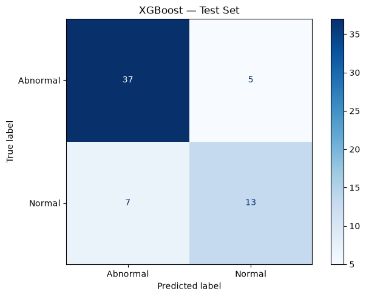
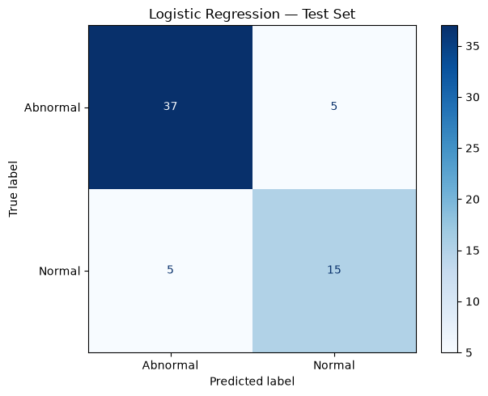
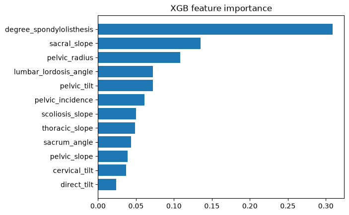
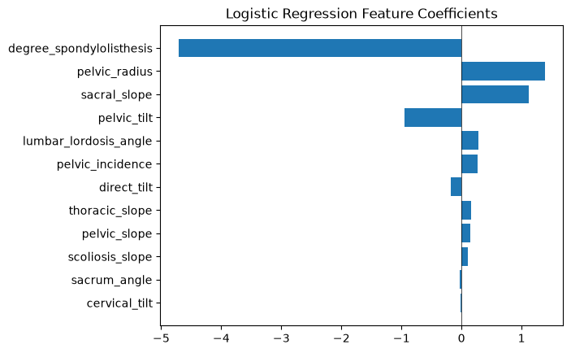

# Back Pain Classification 

This is an exploratory machine learning project intended to practice model development and evaluation. This project compares XGBoost with Logistic Regression for back pain classification. The select models were fine tuned and evaluated using 5-fold cross validation. Results were examined using confusion matrices. 

<strong>📑 Table of Contents</strong>

- [Dataset](#dataset)
- [Methods](#methods)
    - [Preprocessing](#preprocessing)
    - [Training and Evaluation](#training-and-evaluation)
- [Results](#results)
    - [Confusion Matrices](#confusion-matrices)
    - [Feature Importance and Coefficients](#feature-importance-and-coefficients)
- [How to Run](#how-to-run)
- [Limitations](#limitations)
- [Next Steps](#next-steps)

## Dataset

The dataset used comes from Kaggle's [Lower Back Pain Symptoms Dataset](https://www.kaggle.com/datasets/sammy123/lower-back-pain-symptoms-dataset). It contains 310 observations (210 - Abnormal, 100 - Normal) and 12 numerical predictors, including pelvic incidence, pelvic tilt, lumbar lordosis angle, and sacral slope. The model uses all 12 features in the dataset and classifies patient spine records as either Abnormal or Normal.

## Methods:

### Preprocessing: 

- Remove the extra 'notes' column 
- Included mean imputation pipeline for numerical features
- Standardized features for Logistic Regression

### Training and Evaluation:

- Created a stratified 80/20 train/test split
- Tuned Logistic Regression and XGBoost hyperparameters with 'GridSearchCV' using stratified five-fold cross-validation
- Evaluated select models on the held out test set using accuracy, classification reports, ROC-AUC, and confusion matrices.

## Results:
| Model | Mean five-fold CV accuracy | Test accuracy | Test macro F1 | Test ROC-AUC |
| --- | ---: | ---: | ---: | ---: |
| XGBoost | 83.85% | 80.65% | 0.77 | 0.920 |
| Logistic Regression | **84.26%** | **83.87%** | **0.82** | **0.939** |

Across all reported metrics, Logistic Regression performed slightly better than XGBoost.

### Confusion Matrices:

 

The two confusion matrices display the model performance of XGBoost and Logistic Regression, respectively. Values on the main diagonal represent the number of actual Abnormal/Normal cases correctly predicted, while off-diagonal values represent misclassified records. Both models correctly labeled 37 of 42 abnormal cases, while Logistic Regression correctly classified 15/20 normal cases compared to 13 for XGBoost. These 2 additional correct predictions account for Logistic Regression's higher test accuracy of 83.87%, compared with 80.65% for XGBoost.  

### Feature Importance and Coefficients:

 

Above displays the feature importance of the two models, respectively. XGBoost's three highest-ranked features, in descending order, are `degree_spondylolisthesis`, `sacral_slope`, and `pelvic_radius`. These features also have the largest absolute coefficients in Logistic Regression, noting `pelvic_radius` ranks slightly above `sacral_slope`. This suggests that both models emphasize similar features when distinguishing between Abnormal and Normal records. 

## How to Run:

1. Download the project and open its main folder in VS Code.
2. Install the required Python packages: `pandas`, `matplotlib`, `scikit-learn`, `xgboost`, and `ipykernel`.
3. Place `Dataset_spine.csv` in `data/raw/` and create an `images/` folder in the main project folder.
4. Open `notebooks/01_exploration.ipynb`, select a Python kernel with those packages installed, and run the cells from top to bottom.

## Limitations:

The dataset is limited to only 310 observations. Additionally, this model was evaluated on splits of one dataset rather than an independent external validation set due to an inability to find a similar dataset. As a result, performance could vary with a different train/test split. Furthermore, an imbalance of Abnormal vs Normal rows (210 Abnormal and 100 Normal) means the model's overall accuracy is influenced more heavily by its performance on Abnormal records.

## Next Steps:

- Evaluate the models on a larger, independent dataset with comparable spine measurements.
- Test how stable the results are across different train/test splits.
- Explore ways to improve performance on the Normal class, using per-class recall and F1 score to judge whether they help. 